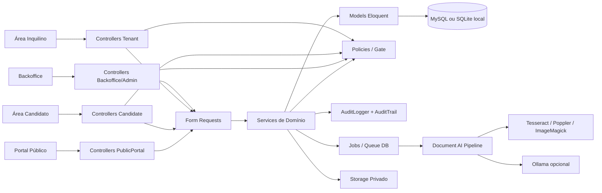
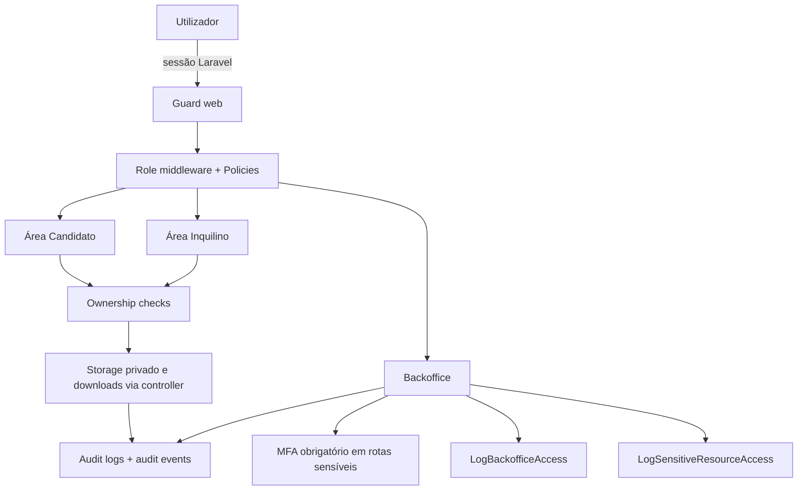
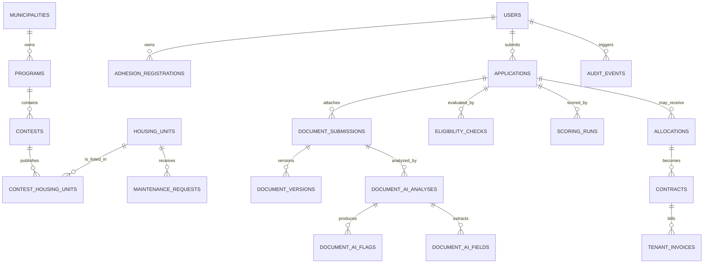
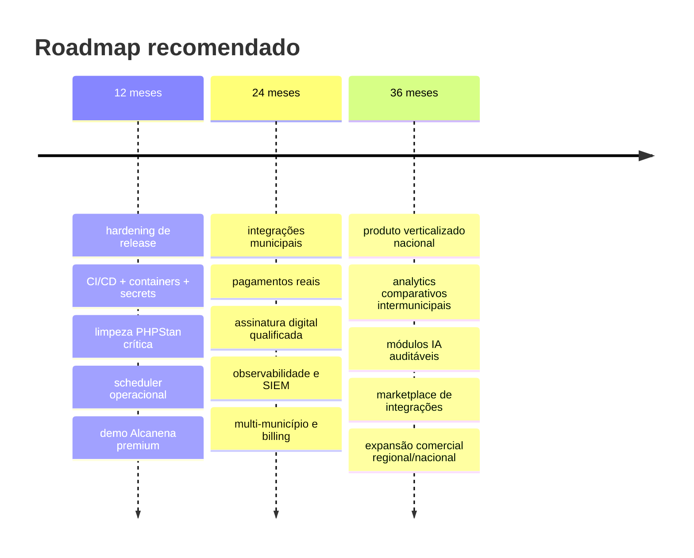

# Auditoria extrema e compreensiva da plataforma CRM Habitação Pública

## Resumo executivo

A versão analisada do **CRM Habitação Pública** revela uma plataforma com **grande amplitude funcional**, muito acima do típico protótipo municipal: o código e a documentação mostram um percurso já materializado para portal público, registo de adesão, candidatura, gestão documental com versionamento, elegibilidade, scoring, listas, reclamações, atribuição, contratos, operação financeira, manutenção, vistorias, RGPD, auditoria e uma camada avançada de **Document Intelligence** executável localmente. Em termos de produto, não é apenas um “CRM”; é já uma base de **sistema operativo municipal de habitação**.

Ao mesmo tempo, a auditoria mostra que o ativo ainda não está no estado ótimo para se apresentar como **produto maduro de referência** sem reservas. O ponto mais forte é o **fit funcional e regulatório para contexto municipal português**; os pontos mais frágeis são **higiene de engenharia, operacionalização e governança do release**. Os achados mais relevantes são estes:

1. **Arquitetura e domínio**: a base é sólida. O repositório contém forte separação por domínio, com **271 controllers, 376 Form Requests, 356 services, 247 models, 221 policies e 51 migrations** no workspace local inspecionado. A documentação interna é extensa e coerente com a evolução do produto.  
2. **Produto para Alcanena**: existe documentação e seeders especificamente orientados para **Alcanena**, incluindo programa, concurso, quatro fogos de demonstração, utilizadores demo e matriz de cobertura dos requisitos. Isto é valioso para a apresentação ao Município.  
3. **Segurança e privacidade**: há sinais claros de maturidade superior à média para um projeto em crescimento — MFA de backoffice sensível, storage privado, masking de auditoria, trilho de eventos, policies por módulo e pipeline local de IA sem dependência obrigatória de cloud.  
4. **Dívida técnica ainda elevada**: a documentação QA do próprio projeto reporta **2897 erros PHPStan** antes da publicação da Sprint 32, apesar de os ficheiros tocados nessa sprint estarem limpos; logo, a dívida está sobretudo espalhada por legado e não pela camada pública de demo. A plataforma pode impressionar funcionalmente, mas ainda precisa de limpeza sistemática para se afirmar como produto enterprise-ready.  
5. **Governança operacional incompleta**: não foram encontrados **Dockerfile, docker-compose, pipelines CI/CD, GitHub Actions nem tarefas agendadas**. `php artisan schedule:list` confirma que não há tarefas definidas. Isto reduz reprodutibilidade, qualidade contínua, observabilidade e previsibilidade de deploy.  
6. **Higiene do workspace/entrega**: o workspace local contém **vendor, node_modules, storage e um `.env` real**. Isto é aceitável como ambiente de desenvolvimento, mas não deve ser usado como artefacto de distribuição institucional/comercial.  
7. **Posicionamento competitivo**: frente a plataformas como **Civica, NEC Housing, MRI, Aareon e Yardi**, o CRM MV HAB ainda fica atrás em operação enterprise, cloud ops, ecossistema e prova de escala. Mas pode tornar-se **claramente superior em adequação ao município português**, soberania dos dados, rapidez de personalização, custo total de posse e narrativa público-digital-local, desde que resolva os gaps críticos identificados. As referências competitivas externas não foram revalidadas nesta execução; ficam classificadas como contexto estratégico, não como evidência extraída da plataforma.

A conclusão estratégica é direta: **a plataforma já tem substância suficiente para uma apresentação forte ao Município de Alcanena**, desde que a apresentação seja desenhada como **demonstração de visão, aderência regulamentar e prontidão evolutiva**, e não como alegação de “produção enterprise totalmente concluída”. O caminho certo é apresentar o ativo como **plataforma municipal especializada, já muito avançada, com roadmap fechado para os pontos ainda em consolidação**.

## Âmbito e inventário

O artefacto principal validado nesta revisão foi o **workspace local atual** em `/Users/brunocorreia/Documents/CRM HAB/crm-habitacao-publica`. Também foi considerada a documentação interna do próprio repositório, incluindo artefactos de QA, arquitetura, backlog e apresentação a Alcanena. O relatório interno `docs/qa/auditoria-mvhab-v2-2026-06-18.md` existe e permanece relevante como referência histórica.

O inventário atual mostra um repositório muito grande para revisão, com **25.606 ficheiros** e cerca de **339 MB** no workspace local. A distribuição é reveladora:

| Área | Nº ficheiros | Peso aproximado | Leitura executiva |
| --- | ---: | ---: | --- |
| `vendor/` | 9.233 | 107 MB | dependências PHP presentes no workspace |
| `node_modules/` | 5.533 | 83 MB | dependências frontend presentes no workspace |
| `storage/` | 7.778 | 131 MB | artefactos, reports, caches, logs e outputs |
| `app/` | 1.799 | 7,8 MB | núcleo aplicacional |
| `resources/` | 609 | 2,8 MB | views, css, js |
| `database/` | 323 | 1,9 MB | migrations, seeders, factories |
| `docs/` | 165 | 3,6 MB | documentação funcional, QA e apresentação |
| `tests/` | 110 | 0,76 MB | testes automatizados |

A leitura mais importante aqui é que o workspace local **não deve ser usado como artefacto de entrega limpa**. A maior parte do peso está em dependências e artefactos (`vendor`, `node_modules`, `storage`). Isto não invalida o produto, mas mostra que a disciplina de distribuição deve ser melhorada antes de qualquer circulação institucional ou comercial.

O inventário lógico do núcleo aplicacional é, pelo contrário, muito rico:

| Domínio | Contagem atual observada |
| --- | ---: |
| Controllers | 271 |
| Form Requests | 376 |
| Services | 356 |
| Models | 247 |
| Policies | 221 |
| Migrations | 51 |
| Seeders | 42 |
| Ficheiros de teste PHP | 79 |
| Views Blade `backoffice/` | 348 |
| Views Blade `candidate/` | 128 |
| Views Blade `public/` | 14 |
| Views Blade `tenant/` | 15 |

Também foram encontrados sinais claros de evolução documental organizada. O diretório `docs/` não é decorativo; contém backlog, QA, roadmap, arquitetura, segurança, experiência do candidato, tenant, portal público, document intelligence e materiais específicos para Alcanena. Isto é raro e valioso numa base proprietária municipal.

**Evidências operacionais confirmadas nesta revisão**

| Verificação | Resultado observado | Leitura |
| --- | --- | --- |
| `php artisan about --only=environment` | Laravel 13.12.0, PHP 8.4.21, ambiente `local`, debug ativo | ambiente válido para desenvolvimento/demo; não é evidência de configuração de produção |
| `php artisan schedule:list` | `No scheduled tasks have been defined.` | confirma ausência atual de scheduler operacional |
| `php artisan test tests/Feature/PublicPortal/PublicHousingPresentationSprint32Test.php tests/Feature/DemoAlcanenaAffordableRentSeederTest.php` | 5 testes, 84 asserções, OK | a camada demo Alcanena validada por estes testes continua operacional |
| `database/database.sqlite` | 17 tabelas locais | artefacto local não representa o schema completo das 51 migrations |
| `storage/phpstan/sprint32-before-publish.json` | `result: failed`, 2897 erros, 17 ficheiros com detalhes | dívida PHPStan confirmada por artefacto QA interno |
| Pesquisa por Docker/CI excluindo `node_modules`, `vendor`, `storage` e `.git` | sem `Dockerfile`, `docker-compose`, `.github`, `.gitlab-ci.yml` ou `Jenkinsfile` do projeto | confirma ausência visível de pipeline/containerização no workspace aplicacional |
| `.env` | presente no workspace local | aceitável em desenvolvimento, crítico se incluído em entrega ou partilha |
| `routes/api.php` | ausente | confirma orientação web monolítica sem API pública dedicada |

**Evidências relevantes extraídas do repositório**

```php
// composer.json
"require": {
    "php": "^8.3",
    "laravel/framework": "^13.8",
    "laravel/tinker": "^3.0"
},
"require-dev": {
    "larastan/larastan": "^3.10",
    "phpstan/phpstan": "^2.2",
    "phpunit/phpunit": "^12.5.12"
}
```

```php
// bootstrap/app.php
$middleware->alias([
    'active.backoffice' => BlockInactiveBackofficeUsers::class,
    'mfa.backoffice' => EnsureBackofficeMfaVerified::class,
    'password.policy' => EnforcePasswordPolicyOnChange::class,
    'role' => EnsureUserHasRole::class,
    'log.backoffice' => LogBackofficeAccess::class,
    'log.sensitive' => LogSensitiveResourceAccess::class,
    'sensitive.permission' => RequireSensitivePermission::class,
]);
```

```php
// config/filesystems.php
'local' => [
    'driver' => 'local',
    'root' => storage_path('app/private'),
    'serve' => true,
],
```

```php
// config/document-ai.php
'ollama' => [
    'enabled' => env('DOCUMENT_AI_OLLAMA_ENABLED', false),
    'base_url' => env('DOCUMENT_AI_OLLAMA_URL', 'http://127.0.0.1:11434'),
    'model' => env('DOCUMENT_AI_OLLAMA_MODEL', 'gemma3:4b'),
],
```

```php
// database/seeders/DemoAlcanenaAffordableRentSeeder.php
$users = [
    ['Administrador Demo Alcanena', 'admin-demo@exemplo.pt', 'administrator'],
    ['Técnico Demo Alcanena', 'tecnico-demo@exemplo.pt', 'municipal_technician'],
    ['Júri Demo Alcanena', 'juri-demo@exemplo.pt', 'jury'],
    ['Candidato Demo Alcanena', 'candidato-demo@exemplo.pt', 'candidate'],
];
```

Há, porém, três achados de inventário que devem ser tratados como **prioridade máxima**:

| Achado | Severidade | Porque importa |
| --- | --- | --- |
| `.env` presente no workspace local | Crítica | risco de exposição de segredos, APP_KEY e credenciais se for partilhado ou empacotado |
| `vendor`, `node_modules` e `storage` incluídos | Alta | aumenta superfície de ataque, peso e ruído de auditoria |
| `database/database.sqlite` com apenas 17 tabelas apesar de 51 migrations | Alta | indica artefacto local desatualizado e potencial inconsistência de ambiente |

## Arquitetura e engenharia

A plataforma assenta sobre **Laravel 13.12.0 em ambiente local** (`composer.json` permite `laravel/framework ^13.8`) com **Breeze + Blade + Tailwind + Alpine + Vite**, o que é tecnicamente coerente para um produto municipal onde previsibilidade, manutenção e onboarding contam tanto como sofisticação frontend. Não foi encontrado `routes/api.php`; a aplicação é dominantemente **web monolítica**, com alguns endpoints JSON pontuais para mapa e utilitários, o que reduz complexidade de superfície mas também limita integração “API-first”.



Em termos de organização de rotas, a estrutura é madura: `routes/web.php` separa claramente **portal público**, **área do candidato**, **área do inquilino** e **backoffice/admin**. A própria árvore de rotas mostra grupos por `area-candidato`, `area-inquilino`, `admin`, `backoffice`, `reports`, `finance`, `maintenance`, `public-portal`, `simulator`, `allocation`, `contracts`, `security` e outros domínios. Isto é um bom sinal de desenho de produto, porque espelha claramente os perfis e responsabilidades.

A observação arquitetural mais positiva é a existência de uma camada forte de **services + requests + policies**, melhor do que em muitos projetos Laravel municipalizados que tendem a concentrar lógica em controllers. No workspace local inspecionado, a plataforma está claramente organizada por domínios de negócio e não apenas por CRUD.



Há também uma decisão arquitetural importante e diferenciadora: a **Document Intelligence** foi desenhada para funcionar **localmente e sem APIs pagas por defeito**, com Tesseract, Poppler, ImageMagick e Ollama opcional. Isto encaixa muito bem numa narrativa de soberania municipal de dados e privacidade-by-default.



Apesar destes méritos, a engenharia ainda não está no patamar desejável para produto de referência. Os principais problemas são estruturais:

| Tema | Estado atual | Leitura técnica |
| --- | --- | --- |
| CI/CD | inexistente visível | não há pipeline padronizado de qualidade |
| Containers | inexistentes | sem Dockerfile/compose, deploy pouco reprodutível |
| Scheduler | inexistente | sem automações nativas de caducidades, retenção, alertas |
| API-first | fraco | arquitetura muito web-centric |
| Observabilidade externa | fraca | não há evidência de tracing, metrics ou SIEM |
| SCA/Dependabot | ausente | vulnerabilidades de dependências podem passar sem controlo |
| Reprodutibilidade local | média | o ambiente local atual executa comandos base, mas continua dependente de configuração manual |

Um detalhe importante: **no ambiente local atual**, `php artisan about --only=environment` executa e confirma Laravel 13.12.0 com PHP 8.4.21. Também foi validada execução focada de testes da Sprint 32. A limitação que permanece é operacional: sem containers oficiais e sem pipeline CI/CD, a reprodução limpa continua dependente da máquina local e da configuração manual de extensões, serviços e memória.

## Análise funcional e operacional

Funcionalmente, a plataforma já cobre quase todo o ciclo de um procedimento municipal de habitação. A melhor forma de a ler é por camadas de processo.

**Portal público.** O módulo público já tem página de fogos, detalhe, mapa, filtros por tipologia, freguesia, estado e renda, além de brochura HTML imprimível e SEO por unidade. A search service pública usa filtros claros, eager loading e limite de 200 marcadores para o mapa, o que é adequado para demonstração municipal. O próprio projeto documenta que a Sprint 32 afinou precisamente a experiência pública para Alcanena.

**Candidato.** O fluxo do candidato está muito mais avançado do que a maioria dos MVPs neste espaço: registo de adesão, agregado, rendimentos, situação habitacional, preferências, documentos, candidatura, correções, audiências, timeline processual, notificações, suporte e reuso de dados.

**Backoffice.** O backoffice é o coração do sistema e já suporta criação de programas e concursos, regras, scoring, listas, sorteios, minutas, relatórios, segurança, RGPD, operações financeiras, manutenção, vistorias e tenant operations. Isto é uma base fortíssima para a apresentação ao Município, porque permite não mostrar apenas frontend público, mas o “motor” administrativo completo.

**Tenant / pós-atribuição.** A existência de área do inquilino, faturas, pagamentos, comunicações, manutenção e vistorias cria uma proposta de valor mais completa do que o habitual em plataformas focadas apenas na fase concursal.

A análise de UX/UI a partir das views e da documentação aponta para uma experiência consistente, legível e institucional, adequada ao setor público. Porém, a plataforma ainda sofre de um risco típico de produtos com grande amplitude: **demasiadas funcionalidades para uma demo única**. A experiência melhorará se a apresentação ao Município for fortemente curada em torno de um guião de 8–12 minutos, e não em navegação livre por menus profundos.

Em desempenho e escalabilidade, o projeto está numa posição intermédia. Há boa base para crescer, mas ainda faltam provas reais de escala:

| Vetor | Estado | Observação |
| --- | --- | --- |
| Paginação | boa | usada em múltiplas listagens |
| Eager loading | razoável | presente em vários serviços e controllers |
| Queue | existe | baseada em `database`, útil mas limitada em escala |
| Relatórios | funcionalmente ricos | podem tornar-se pesados com volumetria real |
| Dashboard executivo | útil | beneficiaria de materialização/cache |
| Carga concorrente | não provada | não há evidência de testes de carga reais |
| Scheduler | ausente | limita automações operacionais |

A documentação interna de performance avisa corretamente para riscos em relatórios, dashboards e logs de auditoria. Isto mostra consciência de engenharia, mas ainda não substitui benchmark de staging com dados reais.

O maior ativo funcional para Alcanena é que o produto não é genérico em abstrato; já existe **alinhamento explícito com o município**, incluindo seeders, programa e concurso demo, demo accounts e documentação de readiness para apresentação. Em termos de narrativa comercial, isto é ouro: não se apresenta “software”; apresenta-se “a plataforma de habitação de Alcanena já modelada”.

## Segurança e conformidade

A segurança intrínseca da aplicação está acima da média para um projeto em crescimento. Os sinais mais fortes são estes:

| Controlos presentes | Evidência no repositório | Leitura |
| --- | --- | --- |
| Storage privado por defeito | `config/filesystems.php` | correto para documentos sensíveis |
| Policies extensas | 221 policies | controlo granular de acesso |
| Middleware de role | `EnsureUserHasRole` | RBAC explícito |
| MFA de backoffice sensível | `EnsureBackofficeMfaVerified` | bom para perfis críticos |
| Audit trail | `AuditLogger`, `AuditEvent` | rastreabilidade sólida |
| Masking de segredos e PII | `AuditEventFormatter` | boa prática real, não apenas declarativa |
| Queue de IA documental | `ProcessDocumentAiJob` | assíncrono controlado |
| IA local e opcional | `config/document-ai.php` | minimiza fuga para terceiros |

Há, no entanto, diferenças claras entre **segurança aplicacional** e **segurança operacional do produto**. A primeira está relativamente bem construída. A segunda ainda não.

Os riscos críticos ou altos são os seguintes:

| Risco | Severidade | Impacto provável | Tratamento recomendado |
| --- | --- | --- | --- |
| `.env` presente no workspace local | Crítica | risco de exposição de segredos e APP_KEY se o workspace for partilhado ou empacotado | remover de qualquer artefacto de entrega, confirmar versionamento, rodar segredos se tiver sido exposto |
| Workspace local inclui `storage/` e artefactos internos | Alta | fuga de logs, relatórios, caches e sinais operacionais se forem incluídos num pacote de release | criar pacote de release limpo |
| Ausência de CI/CD | Alta | regressões silenciosas e releases inconsistentes | pipeline obrigatório com quality gates |
| 2897 erros PHPStan reportados | Alta | bugs latentes em null-safety, tipos e estados | programa de remediação por ondas |
| Sem scheduler | Alta | retenção, alertas e caducidades não automatizados | criar scheduler operacional mínimo |
| Sem containers oficiais | Média/Alta | reprodutibilidade fraca e deployments manuais | Docker + compose + imagem oficial |
| Demo users com password trivial | Média | risco se ambiente demo vazar | segregar apenas para local e reset automático |
| Storage SQLite local desatualizado | Média | inconsistência entre dados e schema; `database/database.sqlite` tem 17 tabelas apesar de existirem 51 migrations | remover artefacto ou gerar seed demo oficial |
| Sem evidência de pentest externo | Média | risco não validado em produção | pentest antes de rollout institucional |

Do ponto de vista de RGPD, o desenho interno é promissor. O projeto já pensa em minimização, storage privado, masking, pedidos do titular e logs auditáveis. Isto tem muito valor numa venda a município, porque a maioria dos concorrentes ganha pela escala; aqui a MicroVida pode ganhar por **controlo local, minimização e adaptabilidade**. A plataforma também escolhe deliberadamente uma pipeline de IA documental **self-hosted/local**, o que ajuda imenso na narrativa de governança de dados.

Na vertente de assinatura digital e confiança, a recomendação arquitetural é clara: quando o módulo avançar de roadmap para produção, a plataforma deve integrar **prestador de confiança qualificado / fluxo eIDAS** e não uma assinatura genérica sem enquadramento público. Esta recomendação é estratégica e não resulta de evidência de implementação já existente no código.

## Benchmark competitivo

No mercado, as plataformas que mais se aproximam deste espaço são suites enterprise de housing/social housing como **Civica Cx Housing**, **NEC Housing**, **MRI PHA Pro**, **Aareon Property Management System** e **Yardi para Affordable Housing/PHA**. Esta secção deve ser lida como contexto estratégico externo; nesta revisão foram validadas evidências locais da plataforma, não foi reexecutada pesquisa externa sobre concorrentes.

| Plataforma | Forças confirmadas | Limitações face ao caso MicroVida | Faixa de custo estimada |
| --- | --- | --- | --- |
| **Civica Cx Housing** | single platform cloud, portal embutido, CRM/comms, integração com Office 365/SharePoint, eForms e captura de assinaturas | muito madura, mas tipicamente mais pesada, mais genérica e menos adaptada ao enquadramento procedimental português | **Custom / enterprise**; inferência prudente: implementação e licença anual em patamar alto |
| **NEC Housing** | módulos de rendas, repairs, assets, risk, customer service, analytics, scheduler mobile, cloud e IA aplicada a operação habitacional | fortíssima em operação e escala, mas orientada ao mercado anglo-saxónico e a organizações maiores | **Custom / enterprise**; inferência prudente: patamar alto |
| **MRI PHA Pro** | compliance de programas HUD, voucher lifecycle, waitlist, portais self-service, comunicações e métricas massivas de clientes/unidades | extremamente robusta em housing norte-americano, mas distante da realidade jurídico-procedimental portuguesa | **Custom / enterprise**; inferência prudente: patamar alto |
| **Aareon** | single source of truth, manutenção e sustentabilidade, apps/portais, ecossistema de integrações e forte presença europeia em housing owners/managers | muito forte em gestão imobiliária europeia, mas menos focada no procedimento concursal municipal português tal como o MV HAB o pode ser | **Custom / enterprise**; inferência prudente: patamar alto |
| **Yardi** | forte cobertura de affordable housing/PHA, built-in compliance, mobility, verification services, maintenance e camada unificada de property management | altamente completa, mas desenhada para escala internacional e menos para parametrização institucional local portuguesa | **Custom / enterprise**; inferência prudente: patamar alto |

A posição mais honesta é esta: **o CRM Habitação Pública ainda não é superior aos líderes enterprise em maturidade operacional, cloud ops, ecossistema e prova pública de escala**. Seria incorreto afirmar isso. Mas existe um espaço competitivo real onde ele pode ser superior:

| Eixo competitivo | Onde o CRM MV HAB pode ganhar |
| --- | --- |
| Adequação a municípios portugueses | muito alta |
| Parametrização rápida de regulamentos/edital/procedimento | muito alta |
| Soberania e localização dos dados | alta |
| Narrativa de IA local e não dependente de cloud paga | alta |
| Custo total de posse para municípios pequenos/médios | potencialmente muito superior |
| Capacidade de co-desenho com o Município | muito superior |
| Tempo de iteração e personalização | superior ao enterprise clássico |

Isto é especialmente relevante porque os fornecedores grandes tendem a vender **capacidade genérica a grande escala**, enquanto a MicroVida pode vender **adequação concreta ao procedimento, ao território e ao cidadão**. A comparação deve ser usada como enquadramento comercial, não como conclusão técnica baseada no código local.

## Roadmap, custos e mitigação

O caminho recomendado não é “continuar a acrescentar features aleatoriamente”. É fechar primeiro a distância entre **plataforma avançada** e **plataforma apresentável como produto de confiança institucional**.



**Plano de mitigação prioritário**

| Prioridade | Tema | Severidade | Impacto | Esforço | Owner sugerido |
| --- | --- | --- | --- | --- | --- |
| Imediata | Remover `.env`, limpar segredos e rever histórico | Crítica | segurança/reputação | Baixo | Tech Lead |
| Imediata | Criar pacote de release limpo sem `vendor/node_modules/storage` | Alta | demos, auditoria, segurança | Baixo | DevOps/Lead |
| Imediata | Pipeline CI com `composer validate`, `pint --test`, `phpunit`, `phpstan` por thresholds | Alta | qualidade contínua | Médio | DevOps |
| Imediata | Dockerfile + compose + bootstrap oficial | Alta | reprodutibilidade | Médio | DevOps |
| Curto prazo | Corrigir PHPStan por ondas focadas em `argument.type`, `property.nonObject`, enums e null-safety | Alta | bugs ocultos | Alto | Equipa backend |
| Curto prazo | Implementar scheduler mínimo | Alta | operação municipal | Médio | Backend |
| Curto prazo | Rever observabilidade, logs estruturados e alerting | Média/Alta | produção e suporte | Médio | DevOps |
| Curto prazo | Pentest externo + revisão DPO/RGPD | Média/Alta | contratação pública | Médio | Segurança + Jurídico |
| Médio prazo | Integração pagamentos | Média | completude do ciclo | Médio/Alto | Backend + parceiro PSP |
| Médio prazo | Assinatura digital qualificada | Média | fecho processual digital | Alto | Backend + jurídico + trust provider |

**Equipa mínima recomendada**

| Perfil | Quantidade | Foco |
| --- | ---: | --- |
| Tech/Product Lead | 1 | arquitetura, priorização, relação município |
| Backend Laravel sénior | 2 | remediação, integrações, scheduler, segurança |
| Frontend/UX engineer | 1 | portal público, flows demo, acessibilidade |
| QA automation | 1 | regressão, test matrix, cenários demo |
| DevOps/SRE part-time | 0,5 a 1 | CI/CD, containers, staging, backups, observabilidade |
| Security/GDPR advisor | 0,2 a 0,5 | pentest, DPO alignment, políticas |
| Comercial/implementação municipal | 1 | apresentação, proposta, onboarding |

**Estimativa pragmática de esforço**

| Horizonte | Objetivo | Esforço |
| --- | --- | --- |
| 4–6 semanas | hardening da demo Alcanena + package hygiene + CI base | 6 a 10 semanas-pessoa |
| 8–12 semanas | remediação crítica PHPStan + scheduler + observabilidade básica | 12 a 18 semanas-pessoa |
| 3–6 meses | readiness institucional com staging, pentest, backups e operação | 20 a 35 semanas-pessoa |
| 6–12 meses | pagamentos + assinatura digital + produto multi-município | 35 a 60 semanas-pessoa |

**Estimativa de custos e infra**

| Rubrica | Faixa prudente |
| --- | --- |
| Infra dev/staging/prod inicial | 300€–1.500€/mês |
| Observabilidade, backups e alerting | 150€–800€/mês |
| Pentest e auditoria externa | 5.000€–20.000€ |
| Trust/signature integration | 5.000€–25.000€ + custos variáveis |
| PSP / pagamentos | setup variável + fee transacional |
| Equipa núcleo 4–6 FTE | principal alavanca de custo |

Em produto e mercado, a melhor monetização não é vender “software puro”, mas um modelo em três camadas:

| Camada | Proposta |
| --- | --- |
| Implementação inicial | parametrização por município, migração, branding, demo e onboarding |
| SaaS anual | licença, suporte, updates, segurança, hosting opcional |
| Módulos premium | IA documental, analytics executivo, tenant ops avançado, pagamentos, assinatura, integrações externas |

## Plano de demonstração e impacto empresarial

A apresentação ao Município de Alcanena deve ser desenhada como **prova de alinhamento, capacidade e seriedade operacional**. Não deve ser uma visita aleatória aos menus.

**Guião recomendado de demonstração**

| Momento | O que mostrar | Mensagem |
| --- | --- | --- |
| Abertura | homepage pública / oferta habitacional / filtros | “o cidadão percebe a oferta” |
| Detalhe de fogo | ficha pública, brochura, privacidade de morada | “transparência sem expor indevidamente” |
| Simulação / elegibilidade | resultado indicativo | “orientação antes da candidatura” |
| Candidatura | documentos, checklist, submissão | “processo digital completo e controlado” |
| Backoffice | análise documental, scoring, listas, relatório | “motor administrativo robusto” |
| Document AI | OCR/classificação/flags/sugestões | “apoio ao técnico, não substituição cega” |
| Segurança/RGPD | logs, storage privado, masking, MFA | “governança e responsabilidade” |
| Fecho | roadmap honesto: pagamentos, assinatura, integrações | “maturidade com transparência” |

O pitch certo para Alcanena não é “temos tudo perfeito”. É:

> “Temos uma plataforma já muito avançada, alinhada com o vosso procedimento, com dados demo de Alcanena, forte preocupação de privacidade e um roadmap fechado para os últimos blocos enterprise.”

Esse discurso é credível e poderoso.

**Cenários de impacto para a MicroVida e para a estabilidade empresarial/familiar**  
Assumo, para estes cenários, que o produto é empacotado como solução municipal vertical, com uma combinação de setup + anualidade + módulos opcionais.

| Cenário | Horizonte | Hipótese comercial | Impacto qualitativo | Impacto quantitativo indicativo |
| --- | --- | --- | --- | --- |
| Conservador | 12 meses | 1 município âncora + prova de conceito robusta | validação forte de portefólio, pouco risco de escala | 25k€–40k€ setup + 45k€–70k€/ano |
| Base | 24 meses | 3 a 5 municípios com versão padronizada | cria linha de negócio própria, reforça tesouraria e reputação institucional | 90k€–180k€ setup acumulado + 180k€–350k€/ano |
| Agressivo | 36 meses | 8 a 12 municípios + módulos premium | transforma MV HAB num produto-core da empresa | 300k€–600k€ setup acumulado + 600k€–1,2M€/ano |

**Leitura prática destes cenários**

No cenário conservador, o maior ganho não é financeiro imediato; é a **validação institucional**. Isso já teria valor estratégico alto para a MicroVida porque abre portas em habitação pública, smart city, atendimento digital e serviços municipais.

No cenário base, o produto pode tornar-se uma unidade de negócio com capacidade para sustentar equipa dedicada, reduzir dependência de trabalho avulso e dar mais previsibilidade financeira à empresa.

No cenário agressivo, o efeito passa a ser transformacional: a família e a empresa deixam de depender apenas de prestação de serviços e passam a ter um **ativo SaaS vertical, replicável e com valor societário acumulável**.

**Perguntas em aberto e limitações**

| Tema | Limitação |
| --- | --- |
| Auditoria anterior | foi usada a documentação interna disponível no repositório; conclusões externas não presentes no workspace não foram assumidas como evidência |
| Prova de carga real | não existiu benchmark de volumetria municipal real |
| Execução local completa | comandos focados foram executados; a suite completa mantém limitações operacionais já documentadas no relatório de qualidade da Sprint 32 |
| Pricing de concorrentes | os fornecedores enterprise analisados operam sobretudo em modelo comercial sem preço público; as faixas apresentadas são inferências prudentes |
| Produção enterprise-ready | exigirá ainda pentest, DPO validation, CI/CD, containers e redução de dívida estática |

A recomendação final é inequívoca: **avançar para apresentação ao Município de Alcanena**, mas com um discurso de **excelência especializada + roadmap de hardening já priorizado**. Se a MicroVida executar as medidas propostas nas próximas 6 a 12 semanas, a plataforma deixa de ser apenas “muito promissora” e passa a estar em condições de competir seriamente como **solução municipal de habitação pública diferenciada em Portugal**.
