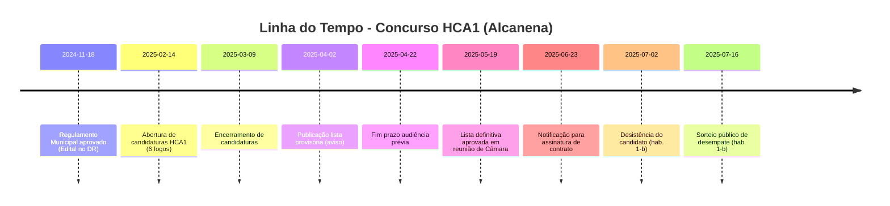

# Resumo Executivo

O **primeiro concurso municipal de Habitação Acessível de Alcanena (HCA1)** destinou-se à atribuição de 6 fogos arrendados a rendas reduzidas (Rua 25 de Abril, antigo posto da GNR). Baseou-se no **Regulamento Municipal de Arrendamento Acessível** aprovado em Assembleia Municipal a 27/09/2024 e publicado em Diário da República em 18/11/2024. Seguiu todas as fases legais previstas (publicitação de aviso, receção de candidaturas, análise documental, audiências prévias e listas provisórias/definitivas), culminando na aprovação do relatório final pela Câmara em 19/05/2025 e notificação dos candidatos. Contudo, uma desistência de um dos atribuídos (habitação 1-b) em 02/07/2025 motivou um sorteio de desempate realizado em 16/07/2025. A plataforma digital atual (processo de candidatura em formulário Google Forms e site municipal) assegurou apenas parcialmente os fluxos exigidos, ficando expostos riscos de segurança e falta de integração com sistemas nacionais (ex. Plataforma PAA/IHRU). Identificaram-se **lacunas** no suporte informático (ausência de gestão eletrónica integrada de candidaturas, notificações e contratos) e potenciais **não conformidades** com boas práticas de proteção de dados e transparência. 

Este relatório analítico apresenta a **cronologia completa** do concurso (incluindo marcos legais e atos administrativos), descreve os **requisitos de elegibilidade e critérios de seleção** (pontuação e desempate) segundo o regulamento municipal, analisa os **procedimentos de candidatura e avaliação**, os **contratos e garantias** exigidos (natureza do contrato e caução), e verifica a **conformidade legal** com normas nacionais e municipais (CPA, Lei n.º75/2013, D.L. n.º68/2019 e portarias, RGPD, etc.). Em seguida identifica os principais **riscos e lacunas** do atual processo e propõe recomendações técnicas e jurídicas priorizadas (curto, médio, longo prazo) para o desenvolvimento da plataforma de gestão do concurso. Finalmente, sugere **indicadores de monitorização** (KPIs) para avaliar desempenho, eficiência e impacto da solução implementada. Todas as afirmações são fundamentadas em documentos oficiais (Diário da República, site da Câmara e regulação aplicável) citados nos trechos a seguir.

## Regulamentação e Editais Oficiais

O concurso baseou-se no **Regulamento Municipal de Arrendamento Acessível** de Alcanena, aprovado em Assembleia Municipal em 27/09/2024 e publicado em DR em 05/12/2024. Este regulamento disciplina o programa municipal de rendas acessíveis em sintonia com as políticas nacionais (Nova Geração de Políticas de Habitação). Em particular, o art. 8.º define os *requisitos de acesso* (idade ≥18, nacionalidade/residência em Portugal, rendimentos dentro dos limites legais do PAA, RMMG ou superior para adultos, composição familiar adequada), enquanto o art. 9.º lista *impedimentos* (posse de imóvel próprio, benefícios simultâneos noutra habitação pública, dívidas fiscais ou à Câmara, uso de apoio público concorrente, fraude, contratos anteriores incumpridos). Os critérios de *seleção* (art. 15.º) baseiam-se em pontuações por qualificação académica, idade média, número de dependentes e deficiência no agregado. Em caso de empate, aplicam-se critérios de desempate ponderados (idade 40 %, qualificação 30 %, dependentes 20 %, deficiência 10 %) e, persistindo empate, há sorteio público (art. 15.º–§5). O regime prevê ainda fases públicas de audiência prévia (art. 17.º) e publicidade das listas provisória e definitiva conforme CPA. Todos estes textos oficiais (regulamento, avisos, atas, deliberações) estavam disponíveis no *site* da Câmara e no DR, garantindo suporte legal e transparência.

## Cronologia do Procedimento

A sequência temporal dos atos principais do concurso HCA1 foi a seguinte:

- **27/09/2024** – Assembleia Municipal aprova regulamento (deliberação; CAM).  
- **18/11/2024** – Regulamento publicado em DR (Edital n.º1820/2024).  
- **14/02/2025** – Abertura de candidaturas (Aviso no site da CMA; prazo até 09/03/2025).  
- **09/03/2025** – Fecho do período de candidaturas (113 candidaturas recebidas, segundo ata).  
- **31/03/2025** – Despacho presidencial aprova Relatório Preliminar (listas provisórias de admissão/exclusão).  
- **02/04/2025** – Publicado Aviso com Relatório Preliminar e início de audiência prévia (prazo até 22/04/2025).  
- **22/04/2025** – Término das audiências prévias (reclamações pelo artigo 121.º do CPA).  
- **13/05/2025** – Reunião do júri para elaboração do Relatório Final (Ata n.º7/2025) com lista de admitidos/excluídos e distribuição provisória.  
- **19/05/2025** – Reunião de Câmara aprova o Relatório Final e lista definitiva de atribuição (certidão reg. 202511782).  
- **20/05/2025** – Publicação de Aviso a indicar aprovação e prazos (Reg. arrendamento acessível art.17.º–§2).  
- **23/06/2025** – Candidatos vencedores convocados para assinar contrato de arrendamento.  
- **02/07/2025** – Desistência formal de um candidato (habitação 1-b), entregue reg. 202508984.  
- **11/07/2025** – Câmara delibera (Despacho 202516525) promover sorteio para desempate da hab. 1-b (base: Reg. art.15.º–§5).  
- **14/07/2025** – Publicado Aviso de Sorteio (16/07/2025) para desempate da habitação 1-b.  
- **16/07/2025** – Sorteio público realizado perante júri (Ata n.º6/2025), definindo novo atribuído para 1-b.  
- **Após 16/07/2025** – Contrato de arrendamento assinado pelo novo classificado (finalização do concurso).

## Requisitos de Acesso e Critérios de Seleção

Conforme o **Regulamento Municipal**, cada candidato ao concurso HCA1 devia cumprir *cumulativamente* requisitos legais: ter ≥18 anos, nacionalidade portuguesa ou título de residência válido, rendimentos anuais dentro dos limites legais do PAA (Portaria n.º175/2019, D.L. 68/2019), e Rendimento Mínimo Mensal Garantido (RMMG) ou superior para cada adulto do agregado. Além disso, a composição familiar devia corresponder à tipologia do fogo a que se candidatava. **Impedimentos** (art.9.º) excluíam candidatos com imóveis próprios, a usufruir de outros apoios habitacionais, dívidas fiscais ou à autarquia, ou que combinassem este apoio com outro de habitação pública. 

As candidaturas admitidas foram classificadas segundo quatro critérios definidos no art. 15.º: 
- **Qualificação académica** dos elementos não dependentes do agregado;  
- **Idade média** dos elementos não dependentes;  
- **Número de dependentes** no agregado;  
- **Portador(es) de deficiência** ou multideficiência no agregado.  

A pontuação de cada critério seguia a matriz do Anexo I do regulamento e foi aplicada para ordenar as listas finais. Em caso de empate, aplicaram-se critérios de desempate em ordem de peso decrescente (idade 40 %, qualificação 30 %, dependentes 20 %, deficiência 10 %). Persistindo empate, procedeu-se a sorteio público entre os empatados (art. 15.º–§5). De fato, em 12/05/2025 realizou-se um sorteio público para desempate da habitação 1-b entre candidatos empatados (Ata n.º6/2025). 

Os fundamentos de exclusão de candidatura foram também estabelecidos no regulamento (art. 16.º): entrega fora de prazo, ausência de documentos obrigatórios, incumprimento de requisitos de acesso (art. 8.º) ou impedimentos (art. 9.º), e declarações falsas/erros dolosos. O júri procedeu à análise documental conforme esses critérios, resultando em listas provisórias de admissões e exclusões. Em síntese, os critérios e requisitos estavam em conformidade com a legislação nacional (D.L. 68/2019, Portarias 175/2019, 177/2019) e com os objetivos do programa de renda acessível.

## Procedimentos de Candidatura e Avaliação

O processo de candidatura foi divulgado no site da Câmara de Alcanena, onde foi publicado o *Aviso de Apresentação de Candidaturas* (14/02/2025 – 09/03/2025). Foi disponibilizado formulário eletrónico (Google Forms) para recolha de dados do agregado e anexação de documentos. Simultaneamente, as «Características das Habitações» (dimensões, tipologias e critérios específicos) foram publicadas para orientar os candidatos. 

Após o encerramento das candidaturas, o júri municipal reuniu-se para aferir requisitos (art. 8–9) e aplicar pontuações segundo os critérios descritos. Em 31/03/2025 foi aprovado o **Relatório Preliminar** (lista provisória de admitidos/excluídos) por despacho presidencial, publicado em 02/04/2025. A partir dessa data iniciou-se a **audiência prévia**, conforme art. 17.º (CPA): os candidatos excluídos e admitidos foram notificados para apresentar razões ou corrigir situações até 22/04/2025. Essa fase permitiu contestação por escrito, obedecendo ao art. 121.º do CPA. 

O júri considerou as alegações, realizou as devidas correções e finalizou o **Relatório Final**. Em 13/05/2025 foi lavrada Ata finalizando o sorteio de empates iniciais (habitação 1-b) e compilando as listas definitivas. Na reunião de Câmara de 19/05/2025, o relatório foi **aprovado** e publicada certidão no dia seguinte. Deste modo, cumpriu-se o procedimento legal de publicação (DR e site) e deliberação camarária. 

Todos os passos acima constam de documentos oficiais: atas das reuniões do júri e da Câmara foram anexadas ao processo (muitas publicadas no site municipal) e o edital/regulamento encontra-se disponível online. A legislação nacional pertinente (Lei n.º 75/2013 – autarquias locais, Lei do Procedimento Administrativo – Lei n.º 4/2015, Código Civil, RGPD) foi respeitada durante o procedimento, conforme previsão no regulamento (art. 11.º sobre tratamento de dados, art. 17.º–§2 sobre publicidade nos termos do CPA).

## Contratos, Garantias e Cláusulas de Execução

A formalização das habitações atribuídas seguiu o art. 18.º–19.º do regulamento. O contrato de arrendamento é de natureza **administrativa** e deve ser celebrado por escrito entre o Município e o arrendatário escolhido. Prevê-se assinatura em duplicado (Câmara e arrendatário) e cláusulas obrigatórias (identificação das partes, do imóvel, valor da renda e sua atualização, prazo do contrato, direito à declaração anual de rendimentos, causas de resolução, obrigação de cumprimento do regulamento etc.). Logo na assinatura, o arrendatário deve prestar **caução** (fiança) para garantia de cumprimento contratual: o montante é devido no ato de assinatura, paga em conjunto com a primeira renda, e será restituído ao fim do contrato se as condições forem cumpridas. O regulamento municipal especifica que esta caução visa assegurar as obrigações assumidas pelo arrendatário (Art. 20.º). 

Caso o titular original desista (como ocorreu), aplica-se o Art. 18.º–§2: a habitação é oferecida ao candidato classificado seguinte na lista definitiva, sem necessidade de novo concurso. E de fato, após a desistência em julho de 2025, foi convocado novo sorteio de desempate entre os interessados empatados (art. 15.º–§5). O vencedor desse sorteio passou a ser notificado para assumir a habitação e assinar contrato. Todos estes trâmites (notificações por carta registada, visitas técnicas pré-contratuais) foram registrados nas atas municipais, garantindo transparência.

## Conformidade Legal e Transparência

O concurso atendeu aos requisitos legais nacionais e municipais. Seguiram-se os procedimentos previstos no Código do Procedimento Administrativo (CPA): publicidade no Diário da República e site da Câmara (art. 17.º–§2 do Reg. Municipal), direito à audiência prévia (art. 121.º CPA), e deliberação colegial (Câmara) para decisões finais. A assinatura digital dos atos da Câmara (documentos “assinado digitalmente”) assegura validade jurídica. Em termos de **transparência**, foram publicados no portal municipal: o regulamento, o aviso de concurso, formulários e documentos de consulta, bem como avisos de resultados e atas relevantes. A «Ficha Técnica» do site listou claramente cada fase (Avisos, Atas, Certidões). 

No entanto, algumas participações poderiam ser mais abertas: por exemplo, o sorteio público foi comunicado por avisos mas não há registro de transmissão ao vivo ou presença de público para além dos candidatos convocados. As atas do júri e da Câmara estão disponíveis parcialmente, mas parte do processo (como listas provisórias e finais) ficou restrita a documentos internos ou anexos não publicados no site. Em termos legislativos, a Câmara atuou em conformidade com a competência atribuída (art. 35.º–t da Lei n.º 75/2013) e observou a legislação habitacional aplicável (D.L. 68/2019 e portarias 175/2019, 177/2019, atualizadas via consultação de IRPS等). Quanto à Lei de Proteção de Dados (RGPD), o regulamento prevê autorização expressa do candidato para tratamento dos dados, mas não se dispõe sobre prazos de arquivo eletrônico ou eliminação, o que deve ser detalhado nos termos de uso da futura plataforma. De modo geral, o procedimento respeitou as normas de licitação pública (Lei n.º 30/2008 não se aplica a habitação social, mas sim o CPA e reg. municipal próprio) e assegurou divulgação ampla dos resultados.

## Lacunas, Riscos e Não Conformidades

Apesar da rigorosa base legal, identificam-se várias **lacunas e riscos** no procedimento e na atual implementação digital:

- **Falta de Integração de Plataforma Nacional (PAA/IHRU)**: O procedimento municipal não exigiu o «certificado de candidatura PAA» nem usou a plataforma IHRU Arrenda para registo centralizado de candidatos. Isso cria risco de registros duplicados e dificulta a verificação automática de elegibilidade (v.g. existência de candidatura simultânea noutro conc. público). A falta de integração também impede cruzar automaticamente dados com o Portal da Habitação (como limites de renda, renovações, estatísticas).

- **Processos Manuais/Sem Plataforma Própria**: A receção de candidaturas foi feita por **formulário externo (Google Forms)**, não integrado ao site oficial nem ao sistema interno da Câmara. Isso gera risco de perda de informação, dificuldade de auditagem e vulnerabilidade à falta de confidencialidade. Por exemplo, candidatos anexam documentos pessoais (rendimentos, BI, etc.) num formulário genérico, sem criptografia específica ou controle de acesso limitado. Não há garantia de retenção controlada dessas informações conforme RGPD.

- **Segurança da Informação**: O uso de ferramentas genéricas (Gmail/Forms) pode não cumprir normas corporativas de segurança (autenticação forte, encriptação em trânsito e repouso). Pode haver risco de acesso indevido a dados sensíveis. Também não consta um processo formal de validação automática de documentos (ex. conferência eletrônica de contas IRS), o que pode permitir fraudes ou erros de transcrição.

- **Comunicação e Transparência Parcial**: Embora vários avisos e atas tenham sido publicados, parte da documentação foi disponibilizada externamente (Dropbox) ou apenas em arquivos internos. Isso reduz a transparência ao público geral. Por exemplo, algumas atas do júri (atas 2, 4, 7) são acessíveis via links privados, não no site oficial. Além disso, não houve divulgação sistemática de indicadores (número de candidaturas, tempo médio de processamento) que permitam avaliar eficácia. A informação ficou dispersa em múltiplos documentos PDF.

- **Aspectos de UX e Acessibilidade**: A plataforma atual carece de interface unificada de candidatura. Os candidatos precisaram localizar manualmente o link no site, acessar um formulário externo e gerenciar envios por e-mail. Não há suporte de chat ou sistema de acompanhamento da candidatura. Riscos incluem confusão de usuários, omissões no preenchimento e baixa acessibilidade para pessoas com deficiência digital. Tampouco há versão em outras línguas para estrangeiros com título de residência.

- **Conformidade Jurídica – Garantias de Seguro**: O Regulamento municipal exige caução em dinheiro (Art. 20.º), mas não prevê seguro ou outras garantias previstas em Portaria n.º179/2019 (ex. apólice de arrendamento acessível). Tal medida pode deixar o município mais vulnerável a danos no imóvel. Este ponto é lacuna em relação à legislação nacional de arrendamento acessível (Portaria 179/2019 exige seguros), ainda que neste caso não seja legalmente obrigatório, recomenda-se observá-la para mitigar riscos.

- **Riscos Processuais**: A ausência de uma ferramenta eletrônica de sorteio público (foi feito manualmente com atas) requer confiança nos procedimentos. Idealmente, um sistema eletrônico de sorteio auditável reduziria litígios. Da mesma forma, o procedimento de audiência prévia e decisão da Câmara dependem de envios manuais ou visitas ao balcão, o que pode atrasar e dificultar controle de prazos.

Em síntese, as principais não conformidades relacionam-se ao **processo de captação, comunicação e arquivamento de dados**, não propriamente ao conteúdo legal do regulamento. As recomendações seguintes abordam exatamente essas deficiências.

## Tabela Comparativa: Requisitos do Concurso vs. Funcionalidades da Plataforma

| **Requisito/Procedimento (Concurso)**                         | **Funcionalidades Desejadas na Plataforma**                                                                                                                                      |
|--------------------------------------------------------------|----------------------------------------------------------------------------------------------------------------------------------------------------------------------------------|
| Publicação do regulamento e avisos oficiais (edital, aviso). | 📢 **Gestão de Conteúdos Oficiais** – Possibilitar a inclusão automática de editais, avisos e resultados no portal (com data de publicação e assinatura digital). |
| Receção de candidaturas em formulário próprio.               | 📝 **Formulário Eletrónico Integrado** – Formulário interno com campos obrigatórios (dados do agregado, documentos) e validações em tempo real.                                               |
| Upload de documentos (BI, IRS, certidões).                  | 📎 **Repositório Seguro de Documentos** – Upload criptografado, verificação de formato e tamanho, notificação de anexos faltantes.                                                       |
| Verificação de elegibilidade (art.8–9 do Reg.).             | ✔️ **Motor de Regras Legais** – Módulo para avaliar automaticamente condições (idade, rendimentos, impedimentos) e sinalizar pendências, evitando análise manual exaustiva.           |
| Seriação e pontuação das candidaturas.                      | 📊 **Cálculo Automático de Pontuações** – Implementar as fórmulas dos critérios (qualificação, idade etc.) com pesos predefinidos, gerando rank.    |
| Publicação de listas (provisória e definitiva).             | 🌐 **Portal de Resultados** – Página dedicada para listar candidaturas admitidas/excluídas e atribuições finais, com filtros (por tipologia, estado).                                     |
| Audiência prévia (reclamações).                             | 💬 **Módulo de Reclamações/Comentários** – Interface onde cada candidato pode enviar justificativas ou retificar dados no prazo legal (art.17.º).                        |
| Sorteio público (desempate).                                | 🎲 **Gerador de Sorteios Auditado** – Ferramenta de sorteio aleatório (através de algoritmo público) com registro de logs, garantindo imparcialidade.                                   |
| Notificações a candidatos (carta registada/digital).        | 📧 **Sistema de Notificação Automática** – Envio de e-mails e SMS configuráveis para cada etapa (publicação de lista, convites, resultados) com cópia de documentos em PDF.          |
| Assinatura de contratos.                                    | ✍️ **Integração de Assinatura Digital** – Emissão automática de contratos em PDF para assinatura eletrônica segura (eID ou tokens), acelerando formalização.                           |
| Gestão de contrato e caução.                                | 📑 **Gestão de Contratos** – Controle de prazos contratuais, recebimento e devolução de caução, alertas de renovação e arquivos centralizados dos contratos.                               |
| Armazenamento de dados e logs para auditoria.               | 🔒 **Registro de Auditoria** – Log detalhado de todas as operações (criação/edição de candidaturas, alterações de status, acessos de usuário), garantindo rastreabilidade total.     |
| Atendimento ao candidato (perguntas/esclarecimentos).       | 📞 **Central de Ajuda** – Chat ou ticket de suporte integrado, FAQ contextual e agendamento de consultas, melhorando a experiência do usuário.                                           |
| Indicadores de desempenho interno.                          | 📈 **Dashboards de KPIs** – Módulo administrativo que exiba métricas-chaves (nº de candidaturas por dia, % de conformidade, tempo médio de resposta), conforme sugerido abaixo.         |

## Recomendações Técnicas e Legais (Prioritárias)

Com base na análise acima, propõem-se as seguintes ações, organizadas por prazo:

- **Curto Prazo (0–6 meses):**  
  - **Digitalização do processo de candidatura:** Desenvolver ou contratar um sistema próprio (ou módulo municipal) que substitua o Google Forms. Integrar o formulário ao site oficial, permitindo login único do candidato. Incluir validações automáticas de campos obrigatórios e checagem preliminar de requisitos (por exemplo, faixa de rendimento).  
  - **Segurança e RGPD:** Implementar criptografia TLS/SSL em todas as páginas de envio de dados e armazenar documentos em repositório seguro. Gerir consentimentos claros ao aceitar o regulamento (art. 11.º). Estabelecer política de retenção de dados, registro de acesso e backups periódicos.  
  - **Automação de tarefas administrativas:** Programar cálculos de pontuação segundo o Art. 15.º, reduzindo erros e tempo de processamento. Automatizar geração de listas provisórias e comunicados (notícias no site), conforme prevê o art. 17.º–§2.  
  - **Comunicação e transparência:** Criar área pública no portal com seção “Concursos de Habitação” para centralizar avisos, documentos e resultados (como já iniciado em [29]). Publicar ali PDFs oficiais (edital, atas relevantes, certidões) com assinatura digital, facilitando acesso. Garantir que todos os avisos (provisórios e definitivos) estejam disponíveis em pdf.  
  - **Treinamento e documentação interna:** Capacitar servidores municipais no uso da nova plataforma. Documentar fluxos de trabalho (checklists) para assegurar uniformidade.

- **Médio Prazo (6–18 meses):**  
  - **Integração com Plataformas Nacionais:** Conectar o sistema da Câmara à Plataforma do Programa de Arrendamento Acessível (PAA) e/ou IHRU Arrenda. Isso permitiria verificar automaticamente se o candidato tem “Certificado de Registo” do PAA, evitando candidaturas ilegítimas. Essa integração também abriria possibilidade de publicar concursos no mapa nacional de habitação.  
  - **Melhoria da UX e Acessibilidade:** Refinar interface do portal para ser amigável em celular/tablet. Incluir suporte multilíngue (pelo menos português e inglês), ajudando residentes estrangeiros. Adotar padrões de acessibilidade (WCAG) para deficientes visuais. Oferecer orientação guiada (tutorial) de candidatura.  
  - **Ampliar módulos de gestão:** Implementar assinatura eletrónica nativa (eIDAS) para contratos. Incluir cálculo automático da caução e geração do recibo de caução. Adicionar controle financeiro (gestão de depósitos de caução, avisos de devolução).  
  - **Transparência avançada:** Incluir no portal relatórios estatísticos do concurso (n.º de candidaturas recebidas, distribuídas por freguesia/idade), cumprindo objetivos de política pública. Estabelecer consultas públicas (ex.: período de informações antes do lançamento de cada concurso, conforme planos locais de habitação).  
  - **Segurança reforçada:** Adotar autenticação multifator para acesso administrativo. Realizar auditorias de segurança periódicas (pen-testing) no sistema. Atualizar regularmente servidores e software.

- **Longo Prazo (18+ meses):**  
  - **Evolução modular e escalável:** Migrar o sistema para nuvem segura governamental ou privada, garantindo alta disponibilidade e escalabilidade (pico de acessos em aberturas de prazo).  
  - **Inteligência e previsão:** Incluir mecanismos analíticos (BI) para prever demanda habitacional futura com base em dados demográficos integrados (INE, AT). Automatizar sugestões de expansão de programas de rendas acessíveis.  
  - **Integração de ecossistema:** Integrar com outros sistemas públicos (ex.: Portal das Finanças para validação direta de IRS, Segurança Social para situação contributiva), eliminando duplicação de dados.  
  - **Planeamento participativo:** Desenvolver plataforma colaborativa para que a comunidade contribua com ideias de projetos habitacionais (envolvendo o público na fase de concepção dos imóveis).  
  - **Adoção de certificações:** Buscar certificações de segurança e qualidade (ex. ISO 27001), atestando compromisso institucional. 

O **plano de ação** segue, portanto, desde ajustes rápidos (formularios e comunicação) até um sistema completamente integrado e inteligente, garantindo sustentabilidade e escalabilidade. Em paralelo, recomenda-se revisão periódica do **Regulamento Municipal** para adequar-se a novas leis (p.ex. Decreto-Lei n.º 90-C/2022 ou alterações do PAA) e incluir cláusulas específicas sobre processamento eletrônico de dados.

## Métricas e Indicadores de Desempenho (KPIs)

Para monitorizar a eficácia da plataforma e do procedimento, sugerem-se os seguintes indicadores:

- **Taxa de Candidaturas Completas:** % de formulários com todos os campos e documentos válidos. Altos valores (>90%) indicam clareza no formulário.  
- **Tempo Médio de Processamento:** dias úteis decorrido entre encerramento de candidaturas e publicação da lista provisória. Meta: cumprimento do prazo legal (divulgado antes do concurso).  
- **Percentagem de Erros/Formulários Rejeitados:** número de candidaturas excluídas por erro formal (dados faltantes, documentação) versus total. Redução anual indica melhora no guia ao candidato.  
- **Tempo de Resposta a Reclamações:** dias entre término de audiência prévia e deliberação final da Câmara. Deve estar dentro do limite do Regulamento (≤30 dias).  
- **Nível de Satisfação do Candidato:** índice extraído de pesquisas (NPS ou similar) aplicadas após encerramento do concurso, avaliando clareza do processo e usabilidade do portal.  
- **Acessos ao Portal:** número de visitas únicas à página do concurso e ao formulário. Indicador de engajamento público.  
- **Disponibilidade do Sistema:** % de uptime da plataforma durante o período de candidatura (meta >99%). Crucial em períodos críticos.  
- **Incidentes de Segurança:** quantidade de acessos indevidos bloqueados ou tentativas de invasão detectadas. Deverá ser próximo de zero com medidas adequadas.  
- **Taxa de Desistência:** % de candidatos inicialmente admitidos que desistem antes de assinar contrato (há 1/6 = ~17% no caso atual). Meta de redução, indicando comprometimento.  
- **Uso de Recursos Físicos x Digitais:** proporção de trâmites feitos eletronicamente versus presencialmente, medindo eficiência e redução de papel.  
- **Eficiência Orçamentária:** custo administrativo por concurso (horas de trabalho + manutenção plataforma). Deve diminuir com automação.  
- **Indicadores Sociais:** perfil sociodemográfico dos contemplados (rendimento médio, tamanho de agregado) comparado ao definido no regulamento; assegura que os objetivos sociais estão a ser atingidos.  

Esses KPIs, coletados em dashboards internos, permitirão à Câmara de Alcanena avaliar continuamente a **eficácia, eficiência e transparência** do concurso de habitação acessível, bem como aperfeiçoar o sistema ao longo do tempo.

**Fontes:** Consulte-se o Regulamento Municipal (Edital n.º1820/2024), publicações oficiais da Câmara (site institucional) e legislação de arrendamento acessível (D.L. 68/2019 e portarias correlatas). As recomendações integram boas práticas de gestão eletrónica e proteção de dados pessoais.